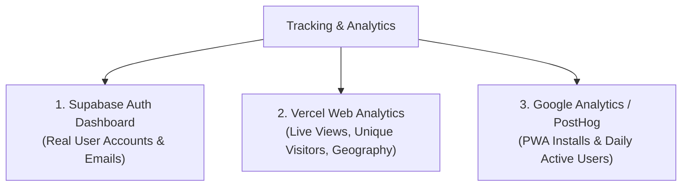
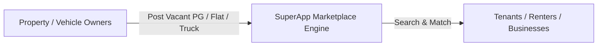

# 🏛️ Family Wealth & Multi-Business SuperApp — Master Documentation & Roadmap

---

## 📌 Executive Summary
**Family Wealth & Stock SuperApp** is India's first unified, privacy-first platform combining:
1. **Family Financial Vault** (Cashflow, Net Wealth, Goals, Digital Documents, Medical SOS).
2. **Inter-Member Aapsi Hisab-Kitab Ledger** (Multi-step running balance, Shopping tasks, WhatsApp Receipts).
3. **8+ Commercial Business Management Modules** (PG/Hostel, Rentals, Transport Fleet, Krishi/Agri, Registered Firms, Garage, Legal Cases, Staff Payroll).
4. **Share Market AI & Financial Academy** (Live Nifty/Sensex, AI Picks, Virtual Paper Trading, F&O/SEBI Academy).
5. **Zero-Cost ChatGPT Plugin / Actions Integration** (OpenAPI 3.0 Webhook).
6. **Bank-Grade Cloud Architecture** (Google OAuth + Supabase PostgreSQL + Storage Buckets).

---

## 🚀 1. Completed Features & Modules Inventory

### A. Core Parivar Financial Suite
- **Interactive Dashboard (`/home`)**: Net worth breakdown, monthly income vs expense burn rate, quick action modals.
- **Member Aapsi Hisab-Kitab Hub (`/family/hisab`)**:
  - 4 Transaction Types: `samaan_shopping`, `cash_transfer`, `work_payment`, `settlement`.
  - Pairwise Net Running Balance calculation (e.g., *Papa owes Rahul ₹1,800*).
  - 1-Click WhatsApp itemized receipt generator.
  - Full audit trail preserved even after settlements.
- **Family Goals & Lakshya Hub (`/wealth/goals`)**: Education, Marriage, Home, Retirement milestone tracking with monthly compounding progress.
- **Udhar & Khata Manager (`/money/udhar`)**: Given/Taken loans with settlement mode logs.

### B. 8+ Business & Commercial Modules
1. **Rentals, PG & Hostel Hub (`/rentals`)**:
   - Flats, Commercial Shops, Godowns, PG/Hostel rooms.
   - Bed Matrix (Single, Double, 3-Sharing, 4-Sharing) with vacancy/occupancy tracking.
   - Electricity Sub-meter calculation (Previous reading, Current reading, Rate/unit).
   - Cook/Maid mess expense tracking & Tenant digital agreement vault.
2. **Gold Loan, Girvi & Private Finance Hub (`/gold-loans`)**:
   - 75% RBI LTV valuation calculator with live 24K gold rates.
   - Gross weight, stone deduction, Karat purity (24K, 22K, 18K, 14K), and net pure gold calculator.
   - Tamper-evident barcode pouch `#SEC-GOLD-XXXXX` and safe locker box tracking.
   - ₹2 Saikda (2% per month) simple/compound byaaj engine.
   - 1-Click WhatsApp Girvi Parchi receipt generator.
   - OTP-verified customer Gold Return NOC Slip to prevent false accusations.
   - 15-Day Legal Auction Notice Generator (Indian Contract Act Sec 176).
3. **Commercial Fleet & Transport Logistics (`/fleet`)**:
   - Trucks, School Buses, Cabs, Delivery Vans.
   - Trip logs (Diesel, Toll, Driver advance, Revenue, Net Profit).
   - Lifetime vehicle ROI & depreciation.
3. **Registered Business Firms & GST (`/firms`)**:
   - Proprietorship & Partnership firms.
   - GST liability, TDS deducted, Annual turnover.
   - Partner drawings & family remuneration log.
4. **Krishi & Agriculture Land (`/agriculture`)**:
   - Khasra numbers, Bigha area, Farming cycles (Rabi, Kharif, Zaid).
   - Theka/Adhiya contract farming & Mandi sales with Govt MSP bonus.
5. **Court & Legal Case Tracker (`/cases`)**:
   - Property, civil, and revenue court cases.
   - Next hearing dates, Case status, Vakil/Lawyer fee ledger.
6. **Household & Staff Payroll (`/staff`)**:
   - Drivers, Maids, Cooks, Security Guards.
   - 31-day attendance matrix, Monthly salary, Advance payment ledger.
7. **Personal & Commercial Garage (`/vehicles`)**:
   - Car/Bike service history, Insurance & PUC renewal alerts.
8. **Encrypted Digital Vault (`/vault`)**:
   - Registry deeds, Insurance policies, FD receipts, Will/Wasiyat documents.
9. **Medical Records & Emergency SOS (`/medical`)**:
   - Blood groups, chronic allergies, emergency doctor contacts, 1-tap SOS alarm.

### C. Share Market AI & Trading Academy
- **Live Markets (`/stocks/markets`)**: Top 30 stocks, Nifty 50, Bank Nifty, Sensex indices.
- **Top 5 AI Stock Picks (`/stocks/predictions`)**: Algorithmic momentum & value scoring with target price and stop-loss.
- **Virtual Paper Trading (`/stocks/paper-trading`)**: ₹10 Lakh virtual balance real-time simulator.
- **Academy & SEBI Compliance (`/stocks/learn`)**: F&O risks, SEBI guidelines, NISM certification guides.

### D. Zero-Cost ChatGPT Plugin / Actions
- **Webhook API**: `GET /api/gpt-action?action=summary&family_id=...`
- **OpenAPI 3.0 Schema**: `GET /api/gpt-action/openapi.json`
- **In-App Integration Hub (`/settings`)**: 1-Click copy of OpenAPI URL and Family Secret Token.

---

## 📊 2. User Tracking, Views & Download Analytics Guide

To monitor how many people are visiting, installing (PWA downloads), and creating accounts:

1. **User Signups & Profiles**:
   - **Supabase Dashboard $\rightarrow$ Authentication $\rightarrow$ Users**: Shows every user who logged in via Google with their email, timestamp, and unique User ID.
2. **Website Traffic & Page Views**:
   - **Vercel Dashboard $\rightarrow$ Analytics Tab**: Shows real-time page views, top visited pages (`/home`, `/stocks`, `/rentals`), and user devices (Mobile vs Desktop).
3. **PWA App Installs ("Downloads")**:
   - Using Google Analytics (GA4) or PostHog, the `appinstalled` browser event tracks every user who clicks "Add to Home Screen".

---

## 🗺️ 3. Future Roadmap: B2C / P2P Asset & Rental Discovery Marketplace

In future versions, the platform can transform from a private manager into a **National Discovery Marketplace**:

### Key Modules on the Roadmap:
1. **PG & Hostel Bed Discovery**: Students/Job seekers find verified beds directly with zero brokerage.
2. **Commercial Fleet Hiring**: Truck & Cab owners list spare capacity for logistics loads.
3. **Agri-Equipment Sharing (Uber for Tractors)**: Farmers rent harvesters, tractors, and tube-wells on hourly/daily rates.
4. **Commercial Shop & Godown Lease Directory**: Direct owner-tenant verified listings.

---

## ⚖️ 4. Indian Law & Regulatory Guide: Private Lending, Girvi, Land Advance & Gold Loans

When building features for private loans, mortgaged land, and gold collateral, Indian law requires strict compliance:

### A. Legal Framework for Private Lending (Peer-to-Peer / Informal)
1. **State Money Lenders Acts**:
   - Informal lending among family, relatives, and friends is legal.
   - However, **commercial money lending as a business** requires a state Money Lending License or an **RBI-registered NBFC** (Non-Banking Financial Company) license.
2. **Cash Transaction Restrictions (Income Tax Act Section 269SS & 269T)**:
   - ⚠️ **Crucial Rule:** Any loan, deposit, or repayment of **₹20,000 or more in CASH is strictly prohibited**.
   - Violations attract a **100% penalty** under Section 271D.
   - All transactions must be conducted via **Banking Channels (UPI, NEFT, RTGS, Account Payee Cheque)**.

### B. Gold Loan (Girvi / Collateral) Rules
1. **RBI LTV Cap**: For institutional lenders, Loan-to-Value (LTV) is capped at **75%** of the certified gold market value.
2. **Purity & Assay**: BIS Hallmark certification and Karat meter testing documentation.
3. **Pledge Agreement (Indian Contract Act Section 172-181)**:
   - A written **Pledge Note / Pawn Ticket** specifying:
     - Gold net weight (excluding stones).
     - Agreed valuation.
     - Monthly interest rate.
     - Maximum default tenure before auction notice.
4. **Secure Vaulting & Insurance**: Physical collateral must be kept in fireproof/bank-grade lockers with mandatory insurance.

### C. Land Advance & Private Mortgage (Bandhak / Girvi)
1. **Section 58 of Transfer of Property Act**:
   - **Simple Mortgage vs Mortgage by Conditional Sale**: Must be executed via a **Registered Mortgage Deed** on non-judicial stamp paper.
   - Oral or unregistered agreements on agricultural land exceeding ₹100 have no legal standing in civil courts.
2. **Security Documents Recommended for the SuperApp Vault**:
   - **Promissory Note (Form 33)** with revenue stamp.
   - **Security Cheque Declaration** (covered under Section 138 of Negotiable Instruments Act).
   - **Possession & NOC Certificate** for dispute prevention.
